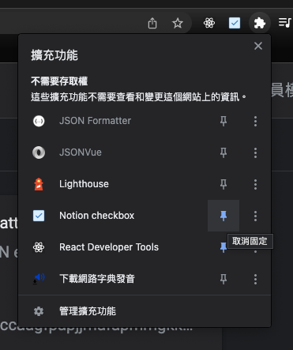
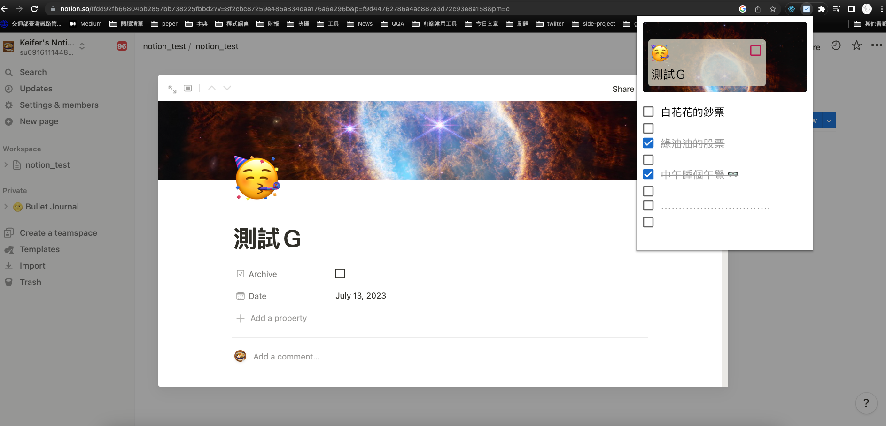

## Chrome Extensions-Notion Checkbox-view
在Chrome提供的擴充功能中，查看特定資料庫，最新頁面的待辦清單。

## Prerequisites
- Node.js 14.16.0
- react 18.2.0

## Other Dependencies
- axios 0.27.2
- react-hook-form 7.45.1
- styled-components 6.0.4
- mui/material 5.14.0

## Install and Execution
1. 請確認有無下載Node.js 和 npm
2. 將專案clone到本地，在終端機入以下指令
`git clone https://github.com/KFR1230/chromeExtensions_notionCheckbox.git`
3. 安裝node_modules，在終端機輸入以下指令
  `npm install`
4. 在終端機輸入以下指令，開啟專案
  `npm build`
5. 到Chrome瀏覽器，輸入以下網址切換到擴充功能
  `chrome://extensions/`
6. 在右上角將開發開發人員模式開啟
  
7. 點擊載入未封裝項目，選擇載入build檔案
  
8. 點擊右上擴充功能圖示，將剛剛載入的項目固定
  

## Features 功能
1. 到notion developers（`https://developers.notion.com/`）建立notion集合。
2. 到特定資料庫點選右上三個點，選擇連線剛剛創建的集合。
  
3. 將notion集合ㄎ提供的secrete記錄下來
  
4. 將notion網址查看database的ID記錄下來
  
5. 輸入secrete、databaseId
  
6. 成功頁面
  
